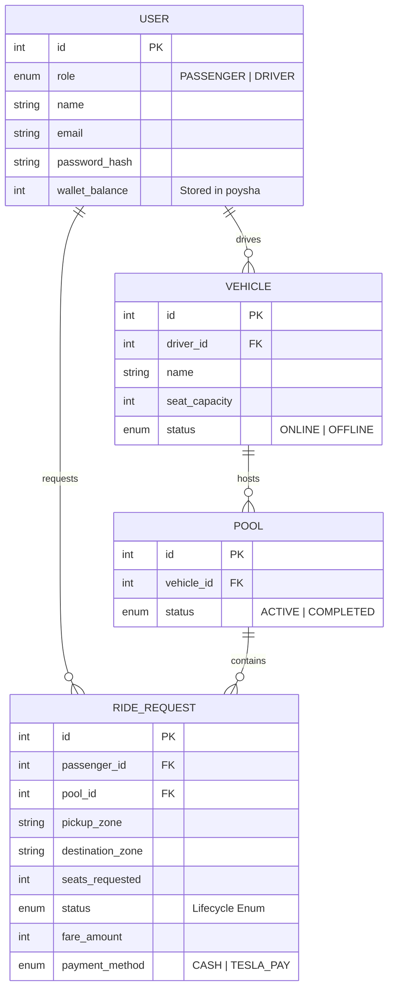

# OiTesla (Dhaka Tesla Pool) ⚡🚕

> **Problem**: Nusrat and Rafiq are both in Banani, both heading to Mohakhali, but they both book separate Dhaka "Tesla" (electric auto-rickshaws). They each pay ৳80 for vehicles that remain 60% empty, while the city gridlocks.

**OiTesla** is a ride-pooling MVP built to solve this exact capacity mismatch. When Nusrat requests a ride, Jashim (the driver of a 3-seat Tesla named "Bullet") accepts it. When Rafiq requests a ride heading in a compatible direction, OiTesla's matching engine dynamically pools him into Jashim's active ride. Both passengers receive a pooled fare discount, and Jashim maximizes his vehicle's capacity. When Shirin tries to claim the last seat simultaneously with Rafiq, the engine uses strict transactional row-locking to guarantee the vehicle is never overbooked.

## Features Implemented
- **Premium UX/UI**: Fully responsive, mobile-first design built with **Tailwind CSS**, **shadcn/ui**, and **Lucide React**. Includes elegant skeleton loaders, zone-selection chips, and custom toast notifications.
- **Dynamic Pooling Engine**: Matches passenger requests to an active pool if the pickup zone is identical and the destination zone is directionally compatible (e.g., Banani → Mohakhali and Banani → Gulshan).
- **Concurrency-Safe Capacity**: Uses PostgreSQL row-locking (`FOR UPDATE SKIP LOCKED`) to ensure two simultaneous requests for a vehicle's final seat never result in overbooking.
- **Strict State Machine**: Enforces a rigid lifecycle (`REQUESTED` → `MATCHED`/`ACCEPTED` → `DRIVER_ARRIVED` → `STARTED` → `COMPLETED`).
- **Real-time UX**: Passengers get dynamic fare previews (base + distance − pool discount) before booking, and the dashboard automatically polls and animates state changes in real-time.
- **Idempotent Fares & TeslaPay**: Calculates fares without float precision errors by using integer `poysha`. Supports automated wallet deductions for TeslaPay or Cash on completion.


*(Screenshots / GIF placeholders)*
- ``
- ``

## Architecture & Database Design

*(Screenshots / GIF placeholders)*
- ``
- ``


### System Architecture
```mermaid
flowchart LR
    Browser[Web Browser] -->|HTTP / JSON| NextJS[Next.js App Router (Tailwind + shadcn)]
    NextJS -->|REST API| Express[Express Node.js API]
    Express -->|Prisma Client| Postgres[(PostgreSQL 15)]
```

### Entity-Relationship Diagram


## Tech Stack & Project Structure
- **Frontend**: Next.js 14 (App Router), React 18, Tailwind CSS v3, shadcn/ui.
- **Backend**: Node.js, Express, TypeScript.
- **Database**: PostgreSQL 15, Prisma ORM.
- **Testing**: Jest, Supertest.
- **DevOps**: Docker & Docker Compose.

**Monorepo Structure:**
- `/apps/web` - Frontend Next.js app with modern styling.
- `/apps/api` - Backend Express API and Prisma schema/migrations.

## Local Setup & Docker Instructions
OiTesla is fully containerized for a zero-configuration cold boot.
1. Clone the repository and copy the environment variables:
   ```bash
   cp .env.example .env
   ```
2. Spin up the cluster:
   ```bash
   docker compose up --build
   ```
*Note: The `api` container is wired to automatically generate the Prisma client, deploy migrations, and run the idempotent seed script (`apps/api/prisma/seed.ts`) before starting the server. Next.js runs on port `3000` and the API runs on `3001`.*

## How to Run Tests
The test suite utilizes Jest and Supertest to validate pooling concurrency, capacity constraints, fare logic, and state transition matrices.
```bash
# Execute within the running API container
docker compose exec api npm run test
```

## Demo Credentials
The database automatically seeds the primary cast on boot. All passwords are `hashedpassword123`.
- **Driver**: `jashim@oitesla.com`
- **Passenger 1**: `nusrat@oitesla.com`
- **Passenger 2**: `rafiq@oitesla.com`
- **Passenger 3**: `shirin@oitesla.com`

## API Overview
## Deployment Constraint
**Deployment URL:** [N/A]
Due to recent shifts in cloud provider policies (Heroku, Render, Railway restricting zero-touch free tiers), deploying a multi-tier Dockerized app with a permanent PostgreSQL instance for absolutely free requires manual identity verification/credit cards. 

**Recommended architecture for manual deployment:**
- **Frontend**: Vercel (Free Next.js hosting).
- **Backend**: Render Free Web Service.
- **Database**: Supabase or Neon.tech (Free PostgreSQL tiers).

- `POST /api/auth/signup` & `POST /api/auth/login` - Role-based JWT authentication.
- `POST /api/rides` - (Passenger) Requests a ride, calculating fare and finding/creating a pool.
- `GET /api/passenger/rides/active` & `/history` - (Passenger) State tracking.
- `PATCH /api/rides/:id/status` - (Passenger) Cancellation endpoint.
- `GET /api/driver/pools` & `/history` - (Driver) Retrieves assigned pooling contexts.
- `PATCH /api/driver/pools/:pool_id/status` - (Driver) Batch advances all ride requests within a pool to the next state (`ACCEPTED` -> `DRIVER_ARRIVED` -> `STARTED` -> `COMPLETED`).

## Key Decisions & Trade-Offs
### Passenger/Driver State Sync (Short-Interval Polling)
To ensure the passenger and driver views reflect the exact same ride state without lag or drift, the MVP utilizes short-interval polling (2–3s) against a single source of truth (the PostgreSQL database). 
- **Limitation**: Introduces a few seconds of staleness and increased server load compared to a persistent connection.
- **Why**: Avoids the complexity of introducing WebSockets, pub/sub queues, or separate state machines for an MVP. Polling is sufficient for early scale and adheres to the "don't add complexity without reason" principle.

### Tech Stack Choices & Alternatives
- **Database (PostgreSQL)**: Picked for robust ACID compliance and row-level locking (`FOR UPDATE SKIP LOCKED`), essential for concurrency. *Alternative*: MongoDB (NoSQL), but lacks native strict row-level locking needed for double-booking prevention. Switch to a distributed SQL (e.g., CockroachDB) at viral scale.
- **ORM (Prisma)**: Picked for rapid MVP prototyping and strict type-safety. *Alternative*: Drizzle or raw pg. Switch if Prisma's transaction overhead becomes a bottleneck.
- **Auth (JWT in localStorage)**: Picked for simplicity and statelessness. *Alternative*: Session cookies or NextAuth. Switch to httpOnly cookies or OAuth providers when moving to production to prevent XSS.
- **Styling (Tailwind + shadcn/ui)**: Picked to build a premium UI rapidly without writing raw CSS. *Alternative*: Styled-components or Bootstrap. Switch if a highly bespoke, non-standard design system is needed.
- **Tests (Jest + Supertest)**: Picked for easy integration testing against the Express API. *Alternative*: Mocha/Chai or Cypress. Switch to Cypress/Playwright when adding full E2E browser tests.
- **Hosting (Docker Compose local)**: Picked to ensure environment parity and zero-config booting. *Alternative*: Vercel/Render. Switch to Kubernetes or managed PaaS when deploying publicly.
1. **Integer Currency (`poysha`)**: Chose to avoid floats completely for standard financial safety.
2. **Simplified Geography**: Built a fixed `COMPATIBILITY_MAP` matrix for zones instead of relying on real-world GIS routing, allowing us to focus entirely on the core capacity algorithms and race-condition safety.
3. **Optimistic Locking vs Pessimistic Locking**: Opted for pessimistic locking (`SELECT ... FOR UPDATE` and `SKIP LOCKED`) when booking rides, as it prevents overlapping reads during extreme concurrency bursts (e.g., Nusrat and Shirin clicking "Book" on the exact same millisecond).

## Viral Scaling Architecture
Curious how OiTesla transitions from a fixed-zone MVP to supporting 1M passengers? Check out the [Scaling Document](SCALING.md).

## Known Limitations & Next Improvements
- **GIS Routing**: Replacing the static zone matrix with Google Maps/Mapbox for live ETA and dynamic overlapping route calculations.
- **WebSocket / SSE Updates**: Currently, the dashboard relies on 2.5-second HTTP polling. WebSockets would provide instant state transitions.
- **Payment Gateway**: Integrating a real gateway like SSLCommerz instead of the simulated TeslaPay wallet.

## AI Usage
- **Tools Used**: Antigravity (Google Deepmind AI agent) for end-to-end scaffolding, logic generation, UI redesign, and automated testing.
- **Suggestion Accepted As-Is**: I adopted the AI's suggestion to use `prisma.$transaction` combined with raw Postgres `SELECT * FROM "Vehicle" FOR UPDATE` row locks to safely enforce vehicle capacity bounds during simultaneous booking requests.
- **Suggestion Rejected/Changed**: I rejected storing the database validation for `seats_requested > 0` directly in the Prisma `schema.prisma` file because Prisma doesn't natively support dynamic `CHECK` constraints cleanly without `Unsupported()`. Instead, I wrote a raw SQL migration specifically to attach the `CHECK` constraint at the database layer.

## Demo Video
[Link to 6-minute demo video (PENDING)]

## Compliance Audit
A full audit against the original project brief is available in [COMPLIANCE.md](COMPLIANCE.md).
