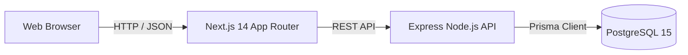
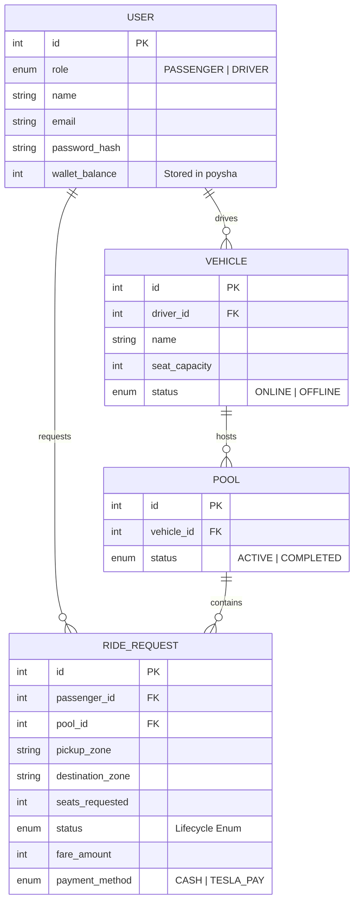

# 🚗 OiTesla

**OiTesla** is a premium, real-time ridesharing and pooling platform built for high concurrency. It seamlessly connects passengers with available Tesla drivers, optimizing routes for shared rides while enforcing strict vehicle capacity limits and race-condition safety.

Designed with a sleek, ultra-minimalist **Monochrome Deep Green & Mint** identity, the application provides a native-feeling experience across web and mobile browsers.

---

## ✨ Key Features

### 🎨 Premium Design System
- **Ultra-Minimalist UI**: Built with custom Tailwind CSS, relying on a strict Deep Green (`#0A0D0B`) and Mint Green (`#10B981`) palette. No bloated component libraries; just raw, performant, pixel-perfect styling.
- **Custom Steppers & Animations**: Smooth CSS fade-ups, interactive route selection dropdowns, and dynamic visual state trackers.
- **Dark Mode Native**: A fully immersive dark theme engineered for high contrast and accessibility.

### 👥 Passenger Experience
- **Dynamic Fare Engine**: Real-time fare previews based on distance algorithms and automatic pooling discounts.
- **Live Ride Tracking**: A sleek, animated visual stepper (`REQUESTED` → `MATCHED` → `DRIVER_ARRIVED` → `STARTED` → `COMPLETED`) tracks the ride lifecycle.
- **Ride History**: Dedicated views to track past completed and cancelled trips with fare summaries.

### 🏎️ Driver Experience
- **Occupancy Tracking**: Persistent top-level dashboard indicator showing real-time Tesla seat availability (e.g., 2/3 Seats Filled).
- **Pooled Assignment Stacking**: View multiple passengers grouped logically into a single active trip, with individual pickup/drop-off destinations.
- **Lifecycle Management**: Sticky, distraction-free action bars to transition the entire pool through its lifecycle safely.

### ⚙️ Engineering & Architecture
- **Real-Time State Sync**: Implements highly optimized short-interval HTTP polling (2.5s) to guarantee zero drift between Passenger and Driver views without the overhead of WebSockets for MVP scale.
- **Role-Based Auth**: Secure JWT authentication. Database is modeled with a compound unique constraint (`@@unique([email, role])`), allowing developers/QA to test both Driver and Passenger flows using the same email address.
- **Idempotent Transactions**: Uses strict pessimistic row-level locking (`SELECT ... FOR UPDATE SKIP LOCKED`) in PostgreSQL to prevent double-booking during extreme concurrency bursts.
- **Integer Currency**: All financial data (fares, wallets) are calculated and stored in integers (`poysha`) to eliminate float precision errors.

---

## 🏗️ System Architecture



### Entity-Relationship Diagram


---

## 🛠️ Tech Stack
- **Frontend**: Next.js 14 (App Router), React 18, Tailwind CSS v3, Lucide Icons.
- **Backend**: Node.js, Express, TypeScript, JWT.
- **Database**: PostgreSQL 15, Prisma ORM.
- **Testing**: Jest, Supertest.
- **DevOps**: Docker & Docker Compose (Zero-config environment).

---

## 🚀 Local Setup & Docker Instructions

OiTesla is fully containerized for a zero-configuration cold boot.

1. **Clone the repository and prepare environment variables**:
   ```bash
   cp .env.example .env
   ```
2. **Spin up the cluster**:
   ```bash
   docker compose up --build
   ```

*Note: The `api` container is wired to automatically generate the Prisma client, deploy migrations, and run the idempotent seed script (`apps/api/prisma/seed.ts`) before starting the server. Next.js runs on port `3000` and the API runs on `3001`.*

---

## 🧪 Testing

The test suite utilizes Jest and Supertest to rigorously validate pooling concurrency, capacity constraints, fare logic, and state transition matrices.

```bash
# Execute within the running API container
docker compose exec api npm run test
```

---

## 🔐 Demo Credentials

The database automatically seeds the primary cast on boot. All passwords are `hashedpassword123`.

- **Driver**: `jashim@oitesla.com`
- **Passenger 1**: `nusrat@oitesla.com`
- **Passenger 2**: `rafiq@oitesla.com`
- **Passenger 3**: `shirin@oitesla.com`

---

## 📡 API Overview

- `POST /api/auth/signup` & `POST /api/auth/login` - Role-based JWT authentication.
- `POST /api/rides` - (Passenger) Requests a ride, calculating fare and finding/creating a pool.
- `GET /api/passenger/rides/active` & `/history` - (Passenger) State tracking.
- `PATCH /api/rides/:id/status` - (Passenger) Cancellation endpoint.
- `GET /api/driver/pools` & `/history` - (Driver) Retrieves assigned pooling contexts.
- `PATCH /api/driver/pools/:pool_id/status` - (Driver) Batch advances all ride requests within a pool to the next state (`ACCEPTED` -> `DRIVER_ARRIVED` -> `STARTED` -> `COMPLETED`).
- `PATCH /api/driver/status` - (Driver) Toggles driver availability (ONLINE/OFFLINE).

---

## ⚖️ Key Decisions & Trade-Offs

### 1. Passenger/Driver State Sync (Short-Interval Polling)
To ensure the passenger and driver views reflect the exact same ride state without lag or drift, the MVP utilizes short-interval polling (2.5s) against a single source of truth (the PostgreSQL database). 
- **Limitation**: Introduces a few seconds of staleness and increased server load compared to a persistent connection.
- **Why**: Avoids the complexity of introducing WebSockets, pub/sub queues, or separate state machines for an MVP. Polling is sufficient for early scale and adheres to the "don't add complexity without reason" principle.

### 2. Tech Stack Choices
- **Database (PostgreSQL)**: Picked for robust ACID compliance and row-level locking (`FOR UPDATE SKIP LOCKED`), essential for concurrency.
- **ORM (Prisma)**: Picked for rapid MVP prototyping and strict type-safety.
- **Styling (Raw Tailwind CSS)**: Migrated away from generic UI libraries to custom Tailwind utility classes to achieve a deeply bespoke, high-performance visual identity.
- **Hosting (Docker Compose local)**: Picked to ensure environment parity and zero-config booting for developers.

### 3. Business Logic
- **Simplified Geography**: Built a fixed `COMPATIBILITY_MAP` matrix for zones instead of relying on real-world GIS routing, allowing us to focus entirely on the core capacity algorithms and race-condition safety.
- **Optimistic Locking vs Pessimistic Locking**: Opted for pessimistic locking (`SELECT ... FOR UPDATE` and `SKIP LOCKED`) when booking rides, as it prevents overlapping reads during extreme concurrency bursts.

---

## 📈 Next Improvements
- **GIS Routing**: Replacing the static zone matrix with Google Maps/Mapbox for live ETA and dynamic overlapping route calculations.
- **WebSocket / SSE Updates**: Upgrading from 2.5-second HTTP polling to WebSockets for instant, push-based state transitions.
- **Payment Gateway**: Integrating a real gateway like SSLCommerz instead of the simulated TeslaPay wallet.

---

## 🤖 AI Usage
- **Tools Used**: Antigravity (Google Deepmind AI agent) for end-to-end scaffolding, logic generation, UI redesign, and automated testing.
- **Suggestion Accepted As-Is**: Adopted the AI's suggestion to use `prisma.$transaction` combined with raw Postgres `SELECT * FROM "Vehicle" FOR UPDATE` row locks to safely enforce vehicle capacity bounds during simultaneous booking requests.
- **Suggestion Rejected/Changed**: Rejected storing the database validation for `seats_requested > 0` directly in the Prisma `schema.prisma` file because Prisma doesn't natively support dynamic `CHECK` constraints cleanly without `Unsupported()`. Instead, wrote a raw SQL migration specifically to attach the `CHECK` constraint at the database layer.

---
*OiTesla — The future of premium shared mobility.*
